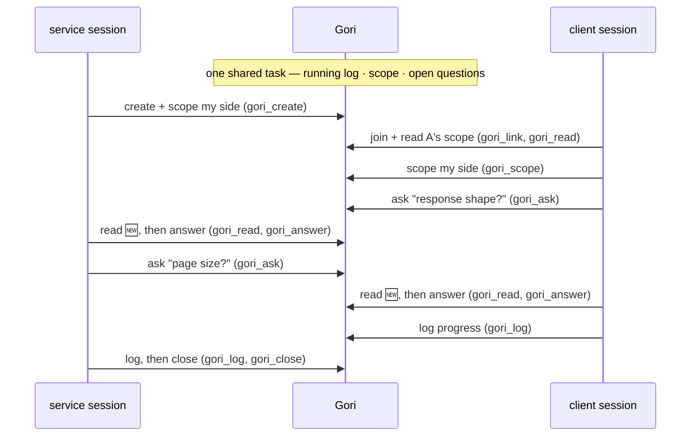

# gori

> A bridge between two AI sessions working on one shared task across separate contexts, most often two coding sessions in separate repos. That task is reflected to both sides each turn: a running log, a structured spec, and the open questions between them.

_gori_ (고리) is Korean for the loop that links two ends.

## The problem

Some work spans two contexts at once. In code that might be a service and the client that calls it, a library and the app that consumes it, or two repos that move together in one change. When two AI sessions each take one side, **the human becomes the relay**, copy-pasting decisions, scope, and "wait, what did the other side call that field?" back and forth between two terminals.

Gori takes the human out of that relay. The two sessions share one task and work through it directly.

This shape isn't specific to code. Two sessions can co-author one document (each owning different sections), coordinating decisions and open questions the same way. Wherever one deliverable is split across two working sessions, Gori is the bridge between them.

## Why Gori?

Without a shared substrate, syncing two sessions is manual and lossy: you copy-paste context between two windows, re-explain what the other side decided, and still find mismatches late. Gori replaces that with one structured, concurrency-safe task both sides edit directly:

- **You stop being the relay.** The sessions coordinate through the task itself, with no copy-paste-and-compare every turn.
- **Tokens go to the work, not the re-sync.** Shared state lives outside the conversation and is read on demand (one section, the open questions) instead of re-pasting a growing context blob into both windows each turn.
- **Less drift, less rework.** Both sides work from one accurate source, with stable references and no lost updates, so fewer mismatches slip through.

And here's how it differs from the obvious alternatives:

- **vs. a shared `SHARED.md`:** a plain file has no structure, stable ids, or locking, so two agents re-read an ambiguous blob, drift, and clobber each other's writes. Gori is a shared workspace with rules, not a text blob.
- **vs. a handoff:** a handoff passes the baton across time: one session summarizes state for the next. Gori works across space: two sessions live at once, coordinating both ways. Use a handoff to continue one line of work; use Gori to run two in parallel.
- **vs. sub-agents:** sub-agents are a **tree**: one root delegating to ephemeral workers in one directory under one person. Gori is an **edge**: two durable, equal sessions in separate roots, optionally driven by two people. For parallel work _inside one repo_, use sub-agents; Gori is for the other shape: two peers pairing across a boundary.

## What it does

One **task** carries two channels and two peers:

- **A running log** (`log`): an append-only timeline of what happened, in order.
- **A structured spec** (`scope` / open questions / answers): durable decisions, each side's boundary, and the questions waiting on the other side, addressable by stable id.
- **Two symmetric sessions**: `pair-A` (the side that created the task) and `pair-B` (the side that joined). The only difference is who started; from then on they are equal peers.

State is **pull-based, reflected each turn**. There is no push or live socket. A session sees the partner's changes the next time it checks (`status` / `read`), and Gori marks a task 🆕 when the partner touched it last, so the agent knows to catch up.

Everything is local flat files under `~/.gori`. No server, no database, no network, no accounts.

Gori keeps the store tidy on its own: once a task is closed, deleted, or two weeks idle, the pointer that maps a session to it is dropped, but the task data itself (the log and spec) is never auto-deleted.

## Worked example

Two sessions, one task. You talk to each agent in plain language; it makes the `gori_*` MCP calls for you. The two sides never talk directly; they coordinate through Gori, which holds the one shared task:



And the same flow as the concrete calls each session makes, side by side:

```
        Pair-A (service session)        │        Pair-B (client session)
────────────────────────────────────────┼──────────────────────────────────────
                                        │
you: "start a gori task for /search     │
      — I'll own the API"               │
  → gori_create(                        │
      "search-endpoint",                │
      "GET /search, ranked results")    │
                                        │
                                        │ you: "pair on it — I'll wire
                                        │       the client to /search"
                                        │   → gori_link    · picks open task
                                        │   → gori_read    · catch up on A
                                        │   → gori_scope(
                                        │       "consume GET /search")
                                        │   → gori_ask("response shape?")
                                        │
  → gori_read    · sees new             │
  → gori_answer("#1",                   │
      "{ results:[...], nextCursor }")  │
  → gori_ask("page size?")              │
                                        │
                                        │   → gori_read    · sees new
                                        │   → gori_answer("#1", "20 default")
                                        │   → gori_log("client wired")
                                        │
  → gori_log("merged to main")          │
  → gori_close                          │
```

## Install & get started

Requires Node.js 22+.

Set up Gori for your agent with one command. `setup` takes an agent flag: `--claude` is the verified path and installs the `/gori` skill; `--cursor` and `--codex` register Gori for those agents too (experimental, no skill). The quickest start is npx, with no global install:

```
npx gori setup --claude     # or --cursor, --codex
```

This is idempotent: it registers the user-scoped MCP server (and, for `--claude`, the `/gori` skill), then asks you to restart the session.

Want the terminal CLI too (`gori status`, `gori log`, …), or want to skip npx's per-launch cold start? Install globally instead, then run the same setup:

```
npm install -g gori
gori setup --claude     # or --cursor, --codex
```

Confirm it's wired by asking your agent to check the gori status, which exercises the MCP tools. (With a global install, `gori --version` works too.)

**Start a pairing.** Open an agent session in each of the two repos you're pairing across, on the same machine. Talk to each agent in plain language and it makes the `gori_*` calls for you, as shown in the worked example above. One side starts the task, the other joins it.

**After a restart**, a session no longer remembers its active task, though the task data is preserved. Ask the agent to reconnect with `gori attach`, which finds the task by the session's current directory.

**Updates.** With the npx setup, the MCP server already tracks the latest published version, so there is nothing to run; re-run `npx gori setup --claude` to refresh the `/gori` skill. With a global install, run `npm install -g gori@latest` and re-run `gori setup --claude`. Your data in `~/.gori` is preserved either way.

## The three surfaces

Gori is one core exposed three ways:

| Surface           | How           | Notes                                                                                                |
| ----------------- | ------------- | ---------------------------------------------------------------------------------------------------- |
| **MCP server**    | `gori mcp`    | The substrate; agents drive Gori through the `gori_*` tools.                                         |
| **`/gori` skill** | `/gori`       | Claude Code only, an optional enhancement layering the pairing choreography on top of the MCP tools. |
| **CLI**           | `gori <verb>` | Direct terminal use, scripting, and debugging (needs the global install).                            |

Today, `gori setup --claude` is the verified path: it registers the MCP server and installs the `/gori` skill (a Claude Code–only enhancement). But the MCP server is a standard stdio server, so any MCP client can use it: `gori setup --cursor` and `gori setup --codex` register it for those agents too (**experimental, not yet verified end-to-end**), and any other client can point at `gori mcp` (or `npx -y gori mcp`) by hand.

## Where Gori is headed

Gori is early (0.x) and evolving. Here's today's shape and where we want to take it. Feedback and contributions are welcome.

- **Local, same machine.** Two sessions share one machine's `~/.gori` today; cross-machine pairing is a planned direction.
- **Two peers per task.** `pair-A` / `pair-B` today; broader topologies are something we're exploring.
- **Pull-based.** A session sees changes on its next check (Gori marks the task 🆕); we'd like to surface changes more richly over time.

## License

MIT. See [LICENSE](LICENSE).
